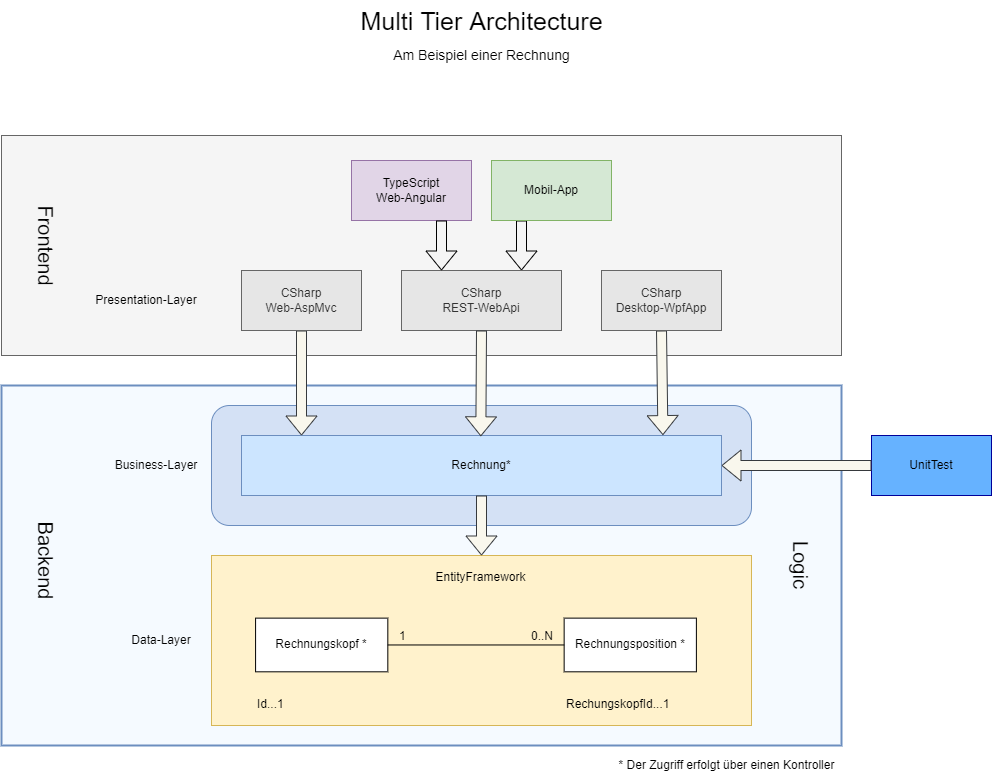

Multi Tier Architecture
=======================

Die ***Multi Tier Architecture*** ist eine sehr häufig angewendetes Strukturmuster für die Architektur von Softwaresystemen. Das ***QuickTemplate*** implementiert ebenfalls diese Struktur  
