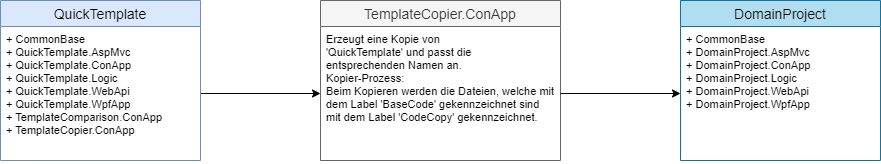
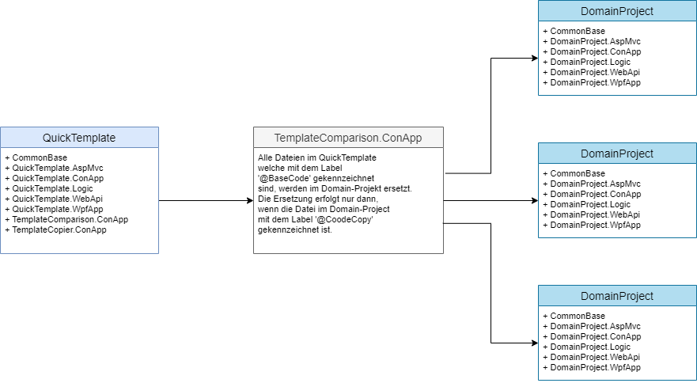

# QuickTemplate

Das Projekt ***QuickTemplate*** ist eine Vorlage für die Erstellung von datenzentrierten Anwendungen. Ausgehend von dieser Vorlage
können neue Anwendungen erstellt und erweitert werden. 

## Infrastruktur

Zur Umsetzung des Projektes wird DotNetCore (6.0 und höher) als Framework, die Programmiersprache CSharp (C#) und die Entwicklungsumgebung Visual Studio 2022 Community verwendet. Alle Komponenten können kostenlos aus dem Internet heruntergeladen werden.

In diese Dokumentation werden unterschiedlichste Begriffe verwendet. In der nachfolgenden Tabelle werden die wichtigsten Begriffe zusammengefasst und erläutert:

|Begriff|Bedeutung|Synonym(e)|
|---|---|---|
|**Solution**|Ist der Zusammenschluss von verschiedenen Teilprojekten zu einer Gesamtlösung.|Gesamtlösung, Lösung, Projekt|
|**Domain Solution**|Hier ist eine Gesamtlösung gemeint, welches für einen bestimmten Problembereich eine Lösung darstellt.|Problemlösung, Projekt|
|**Teilprojekt**|Ist die Zusammenstellung von Klassen und/oder Algorithmen, welches eine logische Einheit für die Lösungen bestimmter Teilprobleme bildet.|Teillösung, Projekteinheit, Projekt|
|**Projekttyp**|Unter Projekttyp wird die physikalische Beschaffenheit eines Projektes bezeichnet. Es gibt zwei grundlegende Typen von Projekten. Zum einen gibt es einen wiederverwendbaren und zum anderen einen ausführbaren Projekttyp. <br>**Als Regel gilt:**<br> Alle Programmteile werden in wiederverwendbare Projekte implementiert. Die ausführbaren Einheiten dienen nur als Startprojekte und leiten die Anfragen an die wiederverwendbaren Projekt-Komponenten weiter.|Bibliothekstyp, Consolentyp|
|**Libray**|Kennzeichnet einen wiederverwendbaren Projekttyp.|Bibliothek|
|**Console**|Kennzeichnet einen ausführbaren Projekttyp. Dieser Typ startet eine Konsole für die Ausführung.|Konsole|
|**Host**|Dieser Typ kennzeichnet ein ausführbares Projekt, welches zum Starten den IIS verwendet oder im Modus 'selfhosting' gestartet werden kann.|Web-Application |
|**Abhängigkeit**|Die Abhängikeit beschreibt die Beziehungen von Projekten untereinander. Benötigt ein Projekt Funktionalitäten aus einem andern Projekt, so wird eine Projektreferenz zum anderen Projekt benötigt.|Projektreferenz, Referenz, Dependency, Projektverweis|

## Template
Die Struktur vom 'QuickTemplate' besteht aus unterschiedlichen Teilprojekten und diese in einer Gesamtlösung (im Kontext von Visual Studio ist das eine Solution) zusammengefasst. Eine Erläuterung der einzelnen Projekte, deren Typ und die Abhängigkeit finden sie in der folgenden Tabelle:

|Projekt|Beschreibung|Typ|Abhängigkeit|
|---|---|---|---|
|**CommonBase**|In diesem Projekt werden alle Hilfsfunktionen und allgemeine Erweiterungen zusammengefasst. Diese sind unabhängig vom Problembereich und können auch in andere Domän-Projekte wiederverwendet werden.|Library|keine|
|**QuickTemplate.Logic**|Dieses Projekt beinhaltet den vollständigen Datenzugriff, die gesamte Geschäftslogik und stellt somit den zentralen Baustein des Systems dar.|Library|CommonBase|
|**QuickTemplate.WebApi**|In diesem Projekt ist die REST-Schnittstelle implementiert. Diese Modul stellt eine API (Aplication Programming Interface) für den Zugriff auf das System über das Netzwerk zur Verfügung.|Host|CommonBase, QuickTemplate.Logic|
|**QuickTemplate.ConApp**|Dieses Projekt dient als Initial-Anwendung zum Erstellen der Datenbank, das Anlegen von Anmeldedaten falls die Authentifizierung aktiv ist und zum Importieren von bestehenden Daten. Nach der Initialisierung wird diese Anwendung kaum verwendet.|Console|CommonBase, QuickTemplate.Logic|
|**QuickTemplate.AspMvc**|Diese Projekt beinhaltet die Basisfunktionen für eine AspWeb-Anwendung und kann als Vorlage für die Entwicklung einer einer AspWeb-Anwendung mit dem QuickTemplate verwendet werden.|Host|CommonBase, QuickTemplate.Logic|
|**QuickTemplate.WpfApp**|Diese Projekt beinhaltet die Basisfunktionen für eine Wpf-Anwendung und kann als Vorlage für die Entwicklung einer einer Wpf-Anwendung mit dem QuickTemplate Framework verwendet werden.|Host|CommonBase, QuickTemplate.Logic|
|**QuickTemplate.XxxYyy**|Es folgen noch weitere Vorlagen von Client-Anwendungen wie Angular, Blazor und mobile Apps. Zum jetzigen Zeitpunkt existiert nur die AspMvc-Anwendung. Die Erstellung und Beschreibung der anderen Client-Anwendungen erfolgt zu einem späteren Zeitpunk.|Host|CommonBase, QuickTemplate.Logic|

## Entwicklerwerkzeuge
Dem Entwickler stehen unterschiedliche Hilfsmittel für die Erstellung von Projekten zur Seite. Die wichtigsten Werkzeuge sind in der nachfolgenden Tabelle zusammengefasst:

|Projekt|Beschreibung|Typ|Abhängigkeit
|---|---|---|---|
|**TemplateCopier.ConApp**|Diese Anwendung dient zum Kopieren des ***QuickTemplate***. Die Vorlage dient als Basis für viele zukünftige Projekte und muss dementsprechend kopiert werden. Der *TemplateCopier* kopiert alle Teilprojekte in den Zielordner und führt eine Umbenennung der Komponenten durch.|Console|CommonBase
|**TemplateComparsion.ConApp**|Dieses Projekt dient zum Abgleich aller mit dem Template erstellten Domän-Projekten.|Console|CommonBase

# Verwendung der Vorlage  

Nachfolgend werden die einzelnen Schritte von der Vorlage ***QuickTemplate*** bis zum konkreten Projekt ***QTMusicStoreLight*** erläutert. Das Projekt ist eine einfache Anwendung zur Demonstration von der Verwendung der Vorlage. Im Projekt ***QTMusicStoreLight*** werden Künstler (Artisten) und deren produzierten Alben verwaltet. Jedes Album hat ein Genre (Rock, Pop, Klassik usw.) zugeordnet. Ein Datenmodell ist im nachfolgendem Abschnitt definiert.
 
## System-Erstellungs-Prozess

### Übersicht  

Wenn nun ein einfacher Service oder eine Anwendung entwickelt werden soll, dann kann die Vorlage ***QuickTemplate*** als Ausgangsbasis verwendet und weiterentwickelt werden. Dazu empfiehlt sich folgende Vorgangsweise:  

#### Vorbereitungen

- Erstellen eines Ordners (z.B.: Develop)
- Herunterladen des Repositories ***QuickTemplate*** von GitHub (<https://github.com/leoggehrer/CSSoftwareEngineering-QuickTemplate> und in den Ordner 'Develop' speichern.  
**ACHTUNG:** Der Solution-Ordner von der Vorlage muss *QuickTemplate* heißen.

#### Projekterstellung
Die nachfolgenden Abbildung zeigt den schematischen Erstellungs-Ablauf für ein Domain-Projekt:  



Als Ausgangsbasis wird die Vorlage ***QuickTemplate*** verwendet. Diese Vorlage wird mit Hilfe dem Hilfsprogramm '*TemplateCopier.ConApp*' in ein Verzeichnis eigener Wahl kopiert. In diesem Verzeichnis werden alle Projektteile von der Vorlage kopiert und die Namen der Projekte und Komponenten werden entsprechend angepasst. Alle Projekte mit einem domainspezifischen Namen werden durch den Namen des Verzeichnisses ersetzt.  

Zum Beispiel soll ein Projekt mit dem Namen 'QTMusicStoreLight' erstellt werden. Im 'TemplateCopier' werden folgende Parameter eingestellt:  

```csharp
Solution copier!
================

Copy 'QuickTemplate' from: ...\source\repos\HtlLeo\CSSoftwareEngineering\QuickTemplate
Copy to 'QTMusicStoreLight':   ...\source\repos\HtlLeo\CSSoftwareEngineering\QTMusicStoreLight

[1] Change target path
[2] Change target solution name
[3] Start copy process
[x|X] Exit

Choose: 3
```

**Hinweis:** Die Vorlage muss im Ordner (*QuickTemplate*) gespeichert sein.  

Nach der Ausführen der Option ***'[3] Start copy process'*** befindet sich folgende Projektstruktur im Ordner **...\QTMusicStoreLight**:  

- CommonBase
- QTMusicStoreLight.AspMvc
- QTMusicStoreLight.ConApp
- QTMusicStoreLight.Logic
- QTMusicStoreLight.WebApi
- QTMusicStoreLight.WpfApp

Im Projekt ***QuickTemplate*** sind alle Code-Teile, welche als Basis-Code in andere Projekte verwendet werden, mit einem Label ***@BaseCode*** markiert. Dieser Label wird im Zielprojekt mit dem Label ***@CodeCopy*** ersetzt. Das hat den Vorteil, dass Änderungen in der Vorlage auf die bereits bestehenden Projekte übertragen werden können (nähere Informationen dazu gibt es später).  

> **ACHTUNG:** Im Domain-Projekt dürfen keine Änderungen von Dateien mit dem Label ***@CodeCopy*** durchgeführt werden, da diesen beim nächsten Abgleich wieder überschrieben werden. Sollen dennoch Änderungen vorgenommen werden, dann muss der Label ***@CodeCopy*** geändert (z.B.: @CustomCode) oder entfernt werden. Damit wird diese Datei auch vom Abgleich, mit der Verlage, ausgeschlossen.

### Abgleich vom ***QuickTemplate*** mit den bestehenden Domain-Projekten  

In der Software-Entwicklung gibt es immer wieder Verbesserungen und Erweiterungen. Das betrifft die Vorlage ***QuickTemplate*** genauso wie alle anderen Projekte. Nun stellt sich die Frage: Wie können Verbesserungen und/oder Erweiterungen von der Vorlage auf die Domain-Projekte übertragen werden? In der Vorlage sind die Quellcode-Dateien mit den Labels ***@BaseCode*** gekennzeichnet. Beim Kopieren werden diese Labels durch den Label ***@CodeCopy*** ersetzt. Mit dem Hilfsprogramm *TemplateComparison.ConApp* werden die Dateien mit dem Label ***@BaseCode*** und ***@CodeCopy*** abgeglichen. In der folgenden Skizze ist dieser Prozess dargestellt:



Für den Abgleichprozess müssen im Projekt ***TemplateComparsion.ConApp*** in der Datei ***Program.cs*** folgende Eintellungen definiert werden:

```csharp
    // QuickTemplate-Projects
    TargetPaths = new string[]
    {
        Path.Combine(UserPath, @"source\repos\HtlLeo\CSSoftwareEngineering\QTMusicStoreLight"),
    };
    // End: QuickTemplate-Projects
```

Im nächsten Schritt wird die Anwendung ***TemplateComparsion.ConApp*** gestartet. Der folgende Benutzer-Dialog wird angezeigt:  

```csharp
TemplateComparison:
==========================================

Source: ...\source\repos\HtlLeo\CSSoftwareEngineering\QuickTemplate\

   Balancing for: [ 1] ...\source\repos\HtlLeo\CSSoftwareEngineering\QTMusicStoreLight
   Balancing for: [ a] ALL


Balancing [1..1|X...Quit]:
```

Wird nun die Option **1 oder a** aktiviert, dann werden alle Dateien im Projekt **QuickTemplate** mit der Kennzeichnung **@BaseCopy** mit den Dateien im Projekt **QTMusicStoreLight** mit der Kennzeichnung **@CodeCopy** abgeglichen.  

### Erstellen der Entitäten  

Das Datenmodell für den **MusicStoreLight** ist wie folgt definiert:

```txt
                +-------------+                 +-------------+
                |             |                 |             |
       +----- n +    Album    + n ----------- 1 +    Genre    |
       |        |             |                 |             | 
       |        +-------------+                 +-------------+
       |
       1
+------+------+
|             |
|   Artist    |
|             |
+------+------+

```


### Definition von *Artist*

| Name | Type | MaxLength | Nullable |Unique|
|------|------|-----------|----------|------|
| Id | int |---|---|---|
| RowVersion | byte[] |---|No|---|
| Name | String | 128 | No |Yes|

### Definition von *Album*  

| Name | Type | MaxLength | Nullable |Unique|
|------|------|-----------|----------|------|
| Id | int |---|---|---|
| RowVersion | byte[] |---|No|---|
| ArtistId | int |---|---|---|
| GenreId | int |---|---|---|
| Title | String | 256 | No |Yes|

### Definition von *Genre*

| Name | Type | MaxLength | Nullable |Unique|
|------|------|-----------|----------|------|
| Id | int |---|---|---|
| RowVersion | byte[] |---|No|---|
| Name | String | 128 | No |Yes|

Die Entitäten werden im Projekt ***QTMusicStoreLight.Logic*** im Ordner ***Entities*** definiert. Nachdem für die Entitäten als Zugriffsstrategie ***Cuncurrency Optimistic*** verwendet wird (RowVersion ist definiert), werden die Entitäten vom bereits definierten ***VersionObject*** abgeleitet.

Die Implementierung der Entität *Artist*:  

```csharp
using Microsoft.EntityFrameworkCore;
using System.ComponentModel.DataAnnotations;
using System.ComponentModel.DataAnnotations.Schema;

namespace QTMusicStoreLight.Logic.Entities
{
    [Table("Artists", Schema = "App")]
    [Index(nameof(Name), IsUnique = true)]
    public class Artist : VersionObject
    {
        [Required]
        [MaxLength(128)]
        public string Name { get; set; } = String.Empty;

        // Navigation properties
        public List<Album> Albums { get; set; } = new();
    }
}
```

Die Implementierung der Entität *Genre*:  

```csharp
using Microsoft.EntityFrameworkCore;
using System.ComponentModel.DataAnnotations;
using System.ComponentModel.DataAnnotations.Schema;

namespace QTMusicStoreLight.Logic.Entities
{
    [Table("Genres", Schema = "App")]
    [Index(nameof(Name), IsUnique = true)]
    public class Genre : VersionObject
    {
        [Required]
        [MaxLength(128)]
        public string Name { get; set; } = String.Empty;

        // Navigation properties
        public List<Album> Albums { get; set; } = new();
    }
}
```

Die Implementierung der Entität *Album*:  

```csharp
using Microsoft.EntityFrameworkCore;
using System.ComponentModel.DataAnnotations;
using System.ComponentModel.DataAnnotations.Schema;

namespace QTMusicStoreLight.Logic.Entities
{
    [Table("Albums", Schema = "App")]
    [Index(nameof(Title), IsUnique = true)]
    public class Album : VersionObject
    {
        public int ArtistId { get; set; }
        public int GenreId { get; set; }
        [Required]
        [MaxLength(256)]
        public string Title { get; set; } = String.Empty;

        // Navigation properties
        public Artist? Artist { get; set; }
        public Genre? Genre { get; set; }
    }
}
```

### Definition vom Datenbank-Kontext  

Nachdem die Entitäten definiert sind, wird nun der Datenbank-Kontext für die Anwendung fertiggesetllt. Aus der Vorlage ***QuickTemplate*** ist der vordefinierte Datenbank-Kontext ***'ProjectDbContext'*** kopiert worden. Diese beinhaltet bereits eine Standard-Implementierung für den generischen Kontroller ***'GenericController&lt;E&gt;'*** und ist als eine **'partielle Klasse'** ausgeführt. Damit diese Klasse angepasst werden kann, wird eine weitere **'partielle Klasse'** zur Klasse ***'ProjectDbContext'*** erstellt. Dazu wird eine Datei mit dem Namen ***'ProjectDbContextExt.cs'*** erstellt. Die Erweiterung ist nachfolgend definiert:

```csharp
using Microsoft.EntityFrameworkCore;
using QTMusicStoreLight.Logic.Entities;

namespace QTMusicStoreLight.Logic.DataContext
{
    partial class ProjectDbContext
    {
        public DbSet<Artist>? ArtistSet { get; set; }
        public DbSet<Album>? AlbumSet { get; set; }
        public DbSet<Genre>? GenreSet { get; set; }

        partial void GetDbSet<E>(ref DbSet<E>? dbSet, ref bool handled) where E : IdentityObject
        {
            if (typeof(E) == typeof(Artist))
            {
                handled = true;
                dbSet = ArtistSet as DbSet<E>;
            }
            else if (typeof(E) == typeof(Album))
            {
                handled = true;
                dbSet = AlbumSet as DbSet<E>;
            }
            else if ((typeof(E) == typeof(Genre)))
            {
                handled = true;
                dbSet = GenreSet as DbSet<E>;
            }
        }
    }
}
```

Wie aus der obigen Implementierung ersichtlich ist, werden für die entsprechenden Entitäten die ***'DbSet&lt;E&gt;'*** definiert. Zusätzlich wird die partielle Methode ***'GetDbSet&lt;E&gt;(...)'*** definiert. Über diese Methode greift der ***'GenericController&lt;E&gt;'*** auf den konkreten ***'DbSet&lt;E&gt;'*** zu.

### Erstellen der konkreten Kontroller  

Der generische Kontroller ***'GenericController&lt;E&gt;'*** implementiert bereits die ***'CRUD'*** Funktionen für eine Entität. Um diese Funktionen für jede Entität zur Verfügung zu stellen, muss für jede Entität ein eigener Kontroller angelegt werden. Die Kontroller werden im Projekt ***QTMusicStoreLight.Logic*** im Ordner ***Controllers*** definiert.  

#### Kontroller für die Entität ***'Artist'*** erstellen

```csharp
namespace QTMusicStoreLight.Logic.Controllers
{
    public sealed partial class ArtistsController : GenericController<Entities.Artist>
    {
        public ArtistsController() : base()
        {
        }

        public ArtistsController(ControllerObject other) : base(other)
        {
        }
    }
}
```

#### Kontroller für die Entität ***'Album'*** erstellen

```csharp
namespace QTMusicStoreLight.Logic.Controllers
{
    public sealed partial class AlbumsController : GenericController<Entities.Album>
    {
        public AlbumsController() : base()
        {
        }

        public AlbumsController(ControllerObject other) : base(other)
        {
        }
    }
}
```

#### Kontroller für die Entität ***'Genre'*** erstellen

```csharp
namespace QTMusicStoreLight.Logic.Controllers
{
    public sealed partial class GenresController : GenericController<Entities.Genre>
    {
        public GenresController() : base()
        {
        }

        public GenresController(ControllerObject other) : base(other)
        {
        }
    }
}
```

> **ACHTUNG:**  Die konkreten Kontroller werden mit dem Schlüsselwort ***'sealed'*** spezifiziert. Die Erklärung folgt zu einem späteren Zeitpunkt.  


**Viel Spaß beim Testen!**
